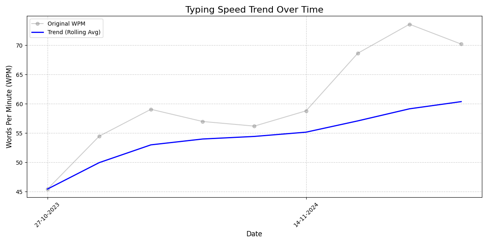
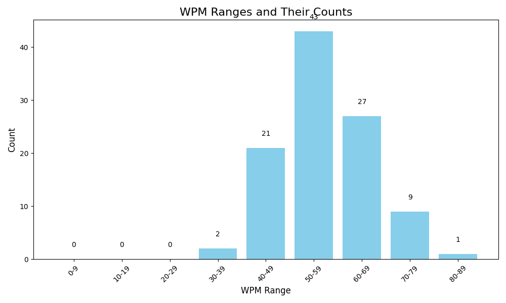

[Configuration](#configuration)
## My public Monkeytype [profile](https://monkeytype.com/profile/zp14)

        
## Typing History Stats (Last Updated: 19/11/2024 09:47)

| **Key Stats**               | **Overall Stats**       | **Last 10 Tests Stats**  |
|--------------------------|-------------------------|--------------------------|
| **Total Entries**        | 100           | 10                       |
| **Average WPM**          | 56.86           | 68.14    |
| **Average Accuracy**     | 93.46%          | 91.81%   |
| **Max WPM**              | 82.8               | 77.2        |
| **Min WPM**              | 34.76               | 57.97                        |
| **Total Duration**       | 01:18:55        | 00:05:00                        |

---

### Last 10 results

| | WPM | Accuracy | Consistency | Mode | Date |
| --- | --- | -------- | ----------- | ---- | --------- |
| 1 | 68.79 | 92.51 | 64.7 | time 30 | 15-11-2024 13:06:10 |
| 2 | 68.37 | 91.15 | 67.33 | time 30 | 15-11-2024 13:05:36 |
| 3 | 71.17 | 94.66 | 66.01 | time 30 | 15-11-2024 13:04:59 |
| 4 | 57.97 | 85.71 | 64.01 | time 30 | 15-11-2024 13:03:27 |
| 5 | 70.37 | 93.16 | 69.4 | time 30 | 15-11-2024 12:02:10 |
| 6 | 67.19 | 88.56 | 68.66 | time 30 | 15-11-2024 12:01:05 |
| 7 | 77.2 | 95.1 | 67.47 | time 30 | 15-11-2024 11:59:02 |
| 8 | 65.18 | 91.67 | 69.38 | time 30 | 15-11-2024 10:35:36 |
| 9 | 65.59 | 89.95 | 63.09 | time 30 | 15-11-2024 10:34:47 |
| 10 | 69.59 | 95.63 | 71.81 | time 30 | 15-11-2024 10:33:41 |

 --- 

### Top 10 results

| | WPM | Accuracy | Consistency | Mode | Date |
| --- | --- | -------- | ----------- | ---- | --------- |
| 1 | 82.8 | 95.87 | 75.66 | time 30 | 15-11-2024 08:43:33 |
| 2 | 77.2 | 95.1 | 67.47 | time 30 | 15-11-2024 11:59:02 |
| 3 | 74.92 | 97.76 | 82.7 | words 25 | 28-10-2023 11:41:53 |
| 4 | 71.99 | 95.41 | 70.5 | time 30 | 15-11-2024 10:31:51 |
| 5 | 71.57 | 93.78 | 69.79 | time 30 | 15-11-2024 08:41:23 |
| 6 | 71.17 | 94.66 | 66.01 | time 30 | 15-11-2024 13:04:59 |
| 7 | 70.37 | 93.16 | 69.4 | time 30 | 15-11-2024 12:02:10 |
| 8 | 69.59 | 95.63 | 71.81 | time 30 | 15-11-2024 10:33:41 |
| 9 | 68.79 | 92.51 | 64.7 | time 30 | 15-11-2024 13:06:10 |
| 10 | 68.78 | 95.56 | 68.97 | time 30 | 15-11-2024 08:39:02 |

 --- 

        

# Configuration

1. **Get API Key from account settings -> ape keys -> generate new key -> check active button next to apekey's name**
2. **Add generated api key to .env file variable apikey**
3. **Install modules** `pip install -r req.txt`
3. **(If you've got less than 1000 tests completed) Run get_data_max_1000.py script that will load data from [Monkeytype](https://monkeytype.com/) and insert into sqllite3 db history.db (this wont be stored on your GitHub)**
4. **Error logs will be stored into logfile.log, and import status will be stored into import_status.log**
5. **stats.py script will get data from db and push them into GitHub account**
6. **You can use API call via ApeKey 30 times per day, so after you reach this limit you wont get any answear and in logfile you will see *Problem with inserting data 0* row**
7. **incremental_import.py will check for the last result time in db and download just those tests that are younger than that. It will also update automatically into GitHub account unless you comment last 2 line of code.**

# UPDATE for 1000+ tests
    
**As monkeytype API enables just 1000 rows to be downloaded via API call, for proper inintial insertion to db tests where there are more than 1000 on your profile
you should export csv file from [Monkeytype account](https://monkeytype.com/account) (over results at the bottom of the site)
and put this csv file into project folder (or set proper path to this file into variable csv_file), then run inintial_csv_read.py script.**
    